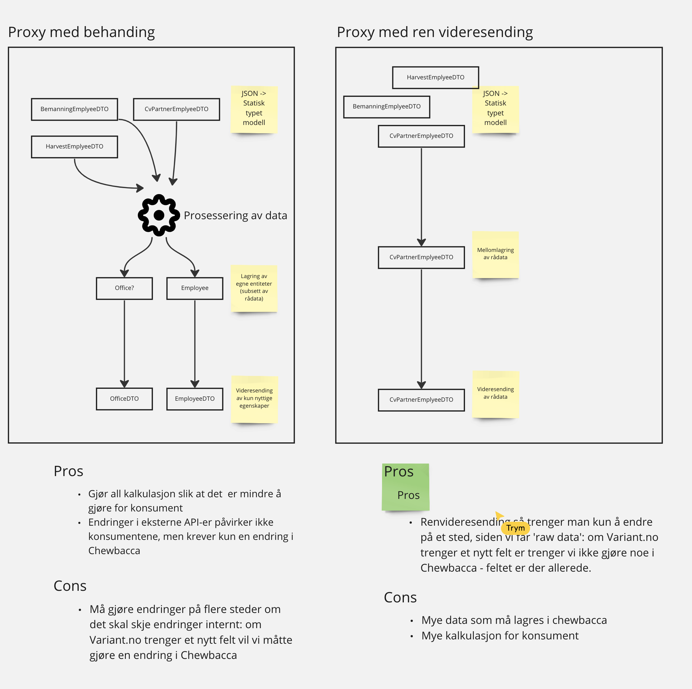

# Behandling vs. Videresending

```
    Dato: 2022-10-25
    Tilstede: Trym, Inge, Tormod
```

## Formål

Beslutte om tjenesten kun mellomlagre rådata og videresende denne, 
eller om den skal behandle rådata, ta vare på det vi trenger og videresende kun dettte. 

## Debatt



## Konklusjon

Prosessering av rådata og videresending av denne vil skjerme internsystemer fra eksterne API-endringer, 
gi enklere konsumering i internsystemer, samt muliggjøre mer avansert databehandling i Chewbacca til 
fremditige formål.

Vi går derfor for denne løsningen.