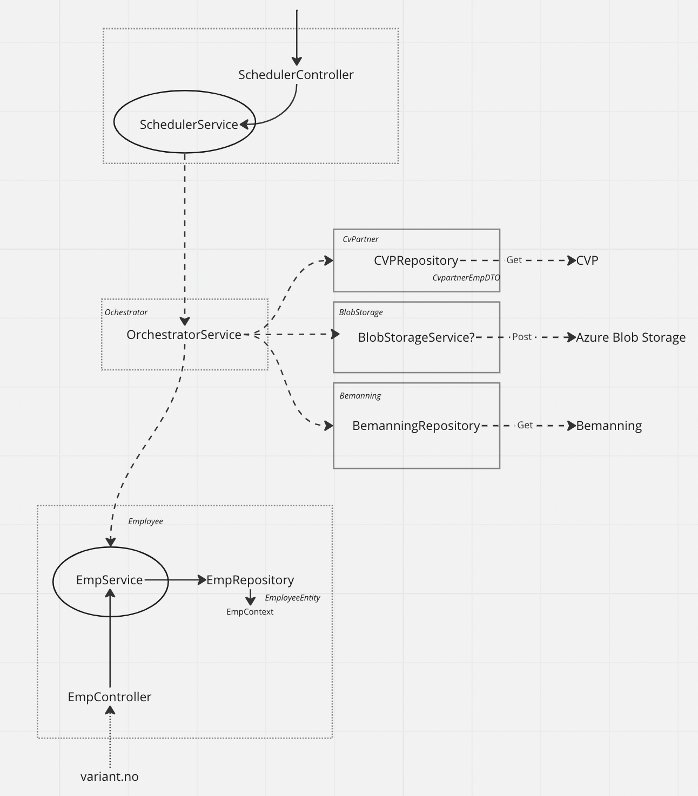

# Struktur
Hensikten med strukturen er å gjøre det enkelt å gjøre endringer på et prosjekt uten å påvirke 
andre prosjekter. Alt som har med CvPartner å gjøre vil ligge under [CvPartner](../../src/CvPartner) for eksempel

### Scheduler(Not Yet Implemented)
Scheduler er applikasjonens klokke. Den vil varsle Orchestrator ved et gitt tidsintervall
og få den til å gjøre alle funksjonene som vi ønsker å gjøre.

### Orchestrator
Orchestrator sitt hovedansvar er å kalle alle funksjonene i applikasjonen. Når metoden til Orchestrator kalles
vil vi hente inn data, oppdatere blob storage og lagre den ansatte til databasen

### CvPartner
CvPartner står for innhenting av data fra CvPartner. 

### BlobStorage
BlobStorage vil lagre bildet til den ansatte ved å bruke bilde url'en fra CvPartner.
Den vil deretter lagre bildet i en blob storage. Per dags dato lagres bildene under `variantno` under 
containeren `employees`

### Bemanning
Bemmanning henter ut en mail og en startsdato. Ved å gjøre en liten [algoritme](../../src/Bemanning/Repositories/BemanningRepository.cs) 
vil den regne ut startsdatoen. Datoen knyttes til en employee ved å matche med mailen fra CvPartner

### Employee
Employee er prosjektet som beskriver hvordan dataen som hentes inn på de interne tjenestene skal se ut.
Employee har en metode for å få alle employees og lagre en employee til databasen.

